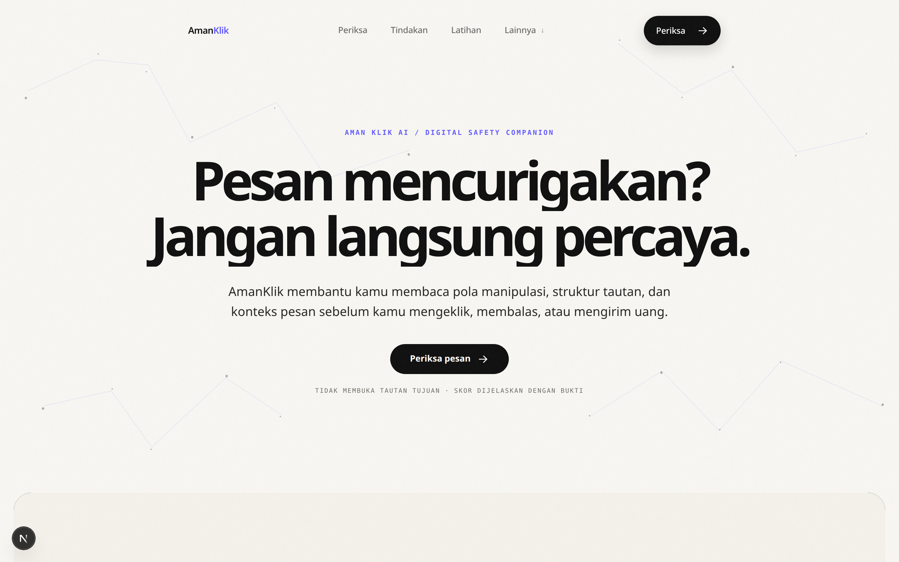
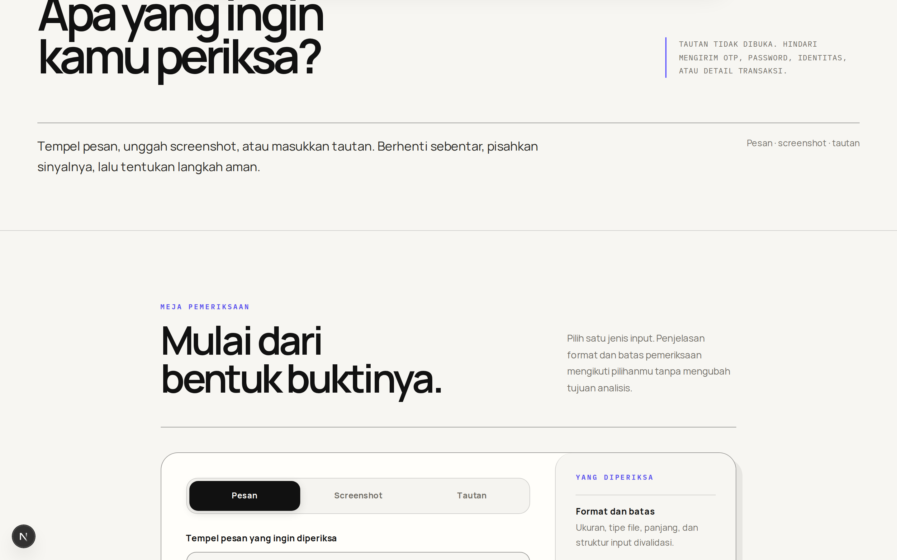
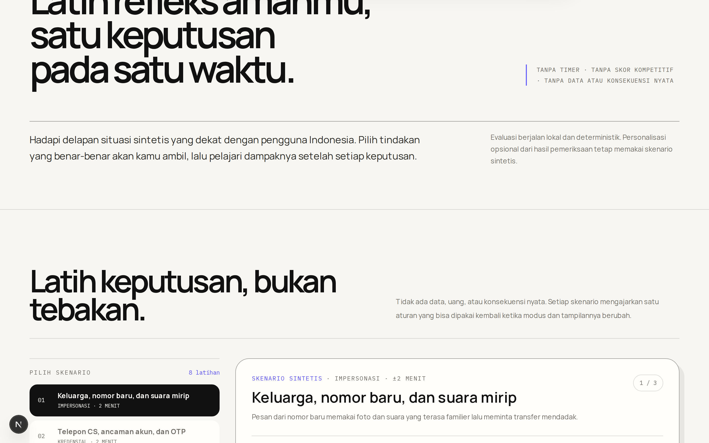
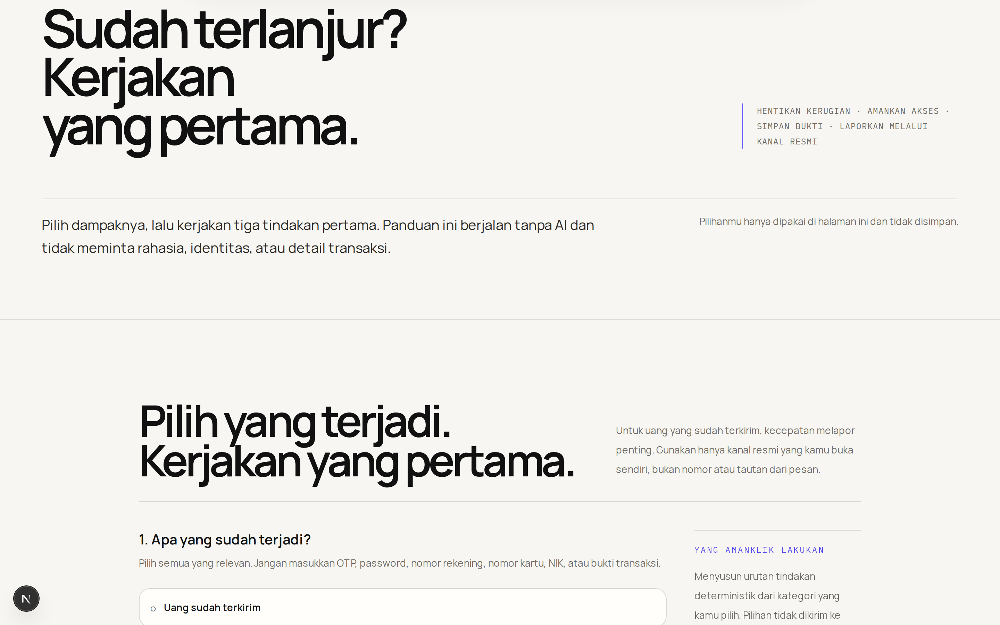
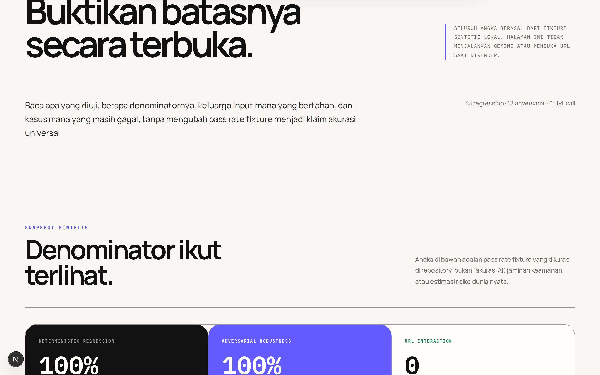

# AmanKlik AI

> Pendamping verifikasi keselamatan digital untuk membaca pola manipulasi, struktur tautan, dan konteks pesan mencurigakan sebelum pengguna mengeklik, membalas, atau mengirim uang.

[](https://amanklik.id)
[](https://nextjs.org/)
[](https://www.typescriptlang.org/)
[](https://ai.google.dev/)
[](https://vitest.dev/)

---

## Informasi Tim & Kompetisi

Proyek ini dikembangkan dan diajukan untuk kompetisi:

* **Kompetisi**: Dies Natalis HIMTIF 2026
* **Kategori**: Web Development (*Innovative Web Solutions*)
* **Nama Tim**: **Bersiaplah**
* **Afiliasi**: HMTI UNIPI (Universitas Insan Pembangunan Indonesia)
* **Website Resmi**: [https://amanklik.id](https://amanklik.id)

### Susunan Tim

| Nama | Peran | Tanggung Jawab Utama |
|---|---|---|
| **Rayhan Soeangkupon Lubis** | Ketua & Full-Stack Engineer | Arsitektur web, sistem desain UI/UX, interaksi gerak GSAP, dan integrasi end-to-end |
| **Deni Setiawan Pratama** | AI & Backend Engineer | Pipeline multimodal AI, engine risiko deterministik, RAG korpus OJK/BI, dan skema database |
| **Galih Eza Kurniawansyah** | Quality Assurance (QA) | Pengujian fungsional, fixture adversarial, audit aksesibilitas, dan verifikasi alur pengguna |

---

## Sekilas Tentang AmanKlik AI

Penipuan digital modern di Indonesia jarang terjadi karena korban buta teknologi. Penipu memanfaatkan manipulasi psikologis: kepanikan mendadak, klaim instansi resmi palsu, rekayasa bukti transfer, dan jebakan aplikasi APK.

**AmanKlik AI** dibangun dengan prinsip *explainable digital safety*:
1. **Bukan Sekadar Black-box AI**: AI mendeteksi konteks semantik, namun skor risiko akhir dikendalikan oleh aturan deterministik yang dapat diaudit.
2. **Keamanan Tanpa Kompromi**: Analisis URL dilakukan secara statis tanpa pernah membuka situs berbahaya. File gambar diproses di memori tanpa menyimpan blob screenshot pengguna.
3. **Edukasi & Mitigasi**: Bukan hanya memberi peringatan, aplikasi melatih keputusan aman pengguna lewat simulator interaktif dan panduan pemulihan darurat jika sudah terlanjur menjadi korban.

---

## Antarmuka & Fitur Utama

### 1. Halaman Utama (Interactive Editorial Landing)
Desain editorial modern dengan tipografi terkurasi, performa 60 FPS, dan visualisasi pemrosesan data real-time.



### 2. Scanner Hub (Pemeriksaan Multimodal)
Pemeriksaan fleksibel untuk empat jenis materi: pesan teks langsung, berkas screenshot chat/layanan, struktur tautan URL, hingga rekaman percakapan bertahap.



### 3. Simulator Keputusan Aman (Latihan Skenario Nyata)
Ruang latihan interaktif dengan delapan situasi sintetis khas penipuan Indonesia (mulai dari voice note deepfake, unduhan APK, phishing perbankan, hingga bukti transfer palsu) untuk melatih refleks aman sebelum situasi sesungguhnya terjadi.



### 4. Sudah Terlanjur? (Triase & Mitigasi Darurat)
Panduan langkah cepat mandiri saat akun atau saldo pengguna telah terdampak. Berjalan secara deterministik tanpa menuntut data pribadi, nomor rekening, PIN, atau OTP.



### 5. Benchmark Transparansi Terbuka
Laporan evaluasi pengujian terbuka yang memperlihatkan tingkat ketahanan model terhadap kasus deterministik dan serangan adversarial secara jujur.



---

## Arsitektur Teknologi

* **Frontend Framework**: Next.js 16 (App Router) & React 19
* **Styling & Interaction**: Tailwind CSS, Vanilla CSS Design System, GSAP 3 (ScrollTrigger), Lenis Smooth Scroll
* **AI & Intelligence Engine**: Google GenAI SDK (`gemini-2.5-flash`), Curated RAG Corpus (Dokumen Edukasi Resmi OJK, Satgas PASTI, & Bank Indonesia)
* **URL Analysis Engine**: Static WHATWG Parser & `tldts` (tanpa menyentuh server target)
* **Database & Persistence**: PostgreSQL, Drizzle ORM
* **Testing & Quality Assurance**: Vitest (Unit & Integration, 129 tests), Playwright (E2E & Accessibility)

---

## Menjalankan Proyek Secara Lokal

### Prasyarat
* Node.js versi 24 LTS atau lebih baru
* pnpm versi 10

### Instalasi & Setup

```bash
# Clone repositori
git clone https://github.com/cryptzoa/AmanKlik_Ai.git
cd AmanKlik_Ai

# Pasang dependensi
pnpm install

# Buat berkas environment lokal
cp .env.example .env.local

# Jalankan server pengembangan
pnpm dev
```

Buka peramban di `http://localhost:3000`. Pemeriksaan kesehatan server dapat diakses melalui `http://localhost:3000/api/health`.

### Pengujian & Validasi Kualitas

```bash
# Pengecekan tipe data TypeScript
pnpm typecheck

# Pengecekan standar kode (ESLint)
pnpm lint

# Menjalankan unit & integration test (129 skenario pengujian)
pnpm test

# Menjalankan end-to-end test Playwright
pnpm test:e2e

# Membangun bundle produksi
pnpm build
```

---

## Hak Cipta & Lisensi

Dikembangkan dengan penuh dedikasi oleh **Tim Bersiaplah (HMTI UNIPI)** untuk **Dies Natalis HIMTIF 2026**. Hak cipta dilindungi undang-undang.
